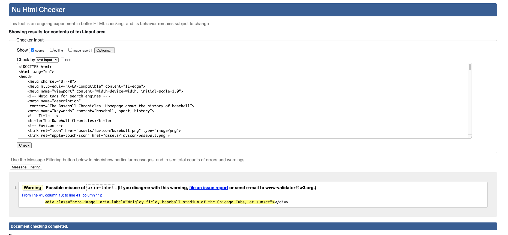
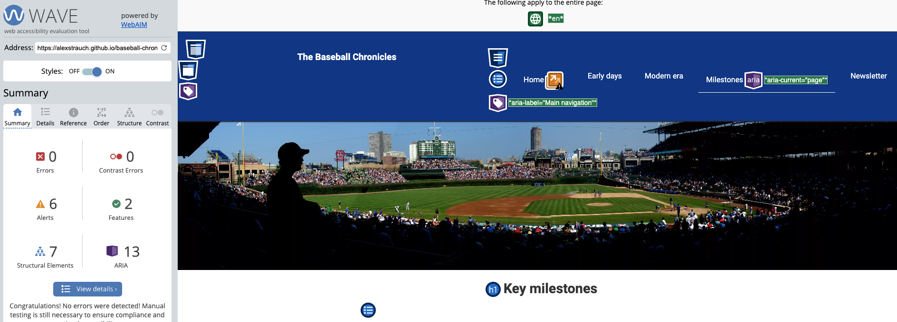

# The Baseball Chronicles
## A website built about the history of baseball

(Developer: Alexander Strauch)

## **[Live site](https://alexstrauch.github.io/baseball-chronicles/index.html)**

## Table of contents

1. [Introduction](#introduction)
    - [Project description](#project-description)
    - [Purpose](#purpose)
2. [UX](#ux)
    - [User demographic](#user-demo)
    - [User goals](#user-goals)
    - [User expectations](#user-expectations)
    - [User stories](#user-stories)
3. [Design](#design)
    - [Design choices](#design-choices)
    - [Fonts](#fonts)
    - [Colors](#colors)
    - [Layout](#layout)
    - [Wireframes](#wireframes)
4. [Features](#features)
5. [Future features](#future-features)
6. [Languages](#languages)
7. [Technologies](#technologies)
8. [Testing](#testing)
    - [HTML validation](#html-validation)
    - [CSS validation](#css-validation)
    - [Performance](#performance)
    - [Accessibility](#accessibility)
9. [Bugs](#bugs)
10. [Deployment](#deployment)
11. [Credits](#credits)
12. [Acknowledgements](#acknowledgements)

## Introduction

### Project description

- The Baseball Chronicles is a web application that offers users an in-depth look at baseball’s most memorable moments, players, and statistics. 

### Purpose
- The purpose of the project is to make baseball history accessible and visually engaging, providing users with curated content about the sport’s past and present. The platform was built to preserve the essence of baseball by showcasing data-driven insights, historical recaps, and player profiles.

[Back to table of contents](#table-of-contents)

## UX

### User demographic

- This project is intended for baseball fans and newcomers of all ages who want to dive deeper into the history of the sport.

### User goals

- Dive into detailed historical data about past seasons, legendary games, and player achievements.

- Discover iconic baseball games, historical records and key milestones

- Stay updated with recent and historical events

- Compare the statistics of the greatest players of all time

### User expectations

- Accessible website on all devices

- Responsive design on all devices without layout or performance issues

- User-friendly interface with easy access to the provided information

- Links and features that work the way they are intended to

- Clean modern visual appearance which follows best practices

- Comprehensive baseball insights of major events that took place

### User stories

#### User

- As a new baseball fan I want a simple, beginner-friendly interface that allows me to explore player stats and learn about the game without feeling overwhelmed

- As a casual baseball fan I want to read about famous baseball events and moments so that I can relive key games and learn about the history of the sport

- As a dedicated fan I want to be able to find a website about the history of baseball

- As a baseball historian I want to compare historical team and player performances

#### Site owner

- As the operator of the site I want to be able to showcase the history of baseball to interested users

- As the the site owner I want to provide an enagaging user experience

- As the site owner I want to display important historical data from key events that took place

- As the site owner I want to promote the site to grow the user base

- As the site operator I want to continuously improve the platform

[Back to table of contents](#table-of-contents)

## Design

### Design choices

Since I'm a big baseball fan (Go Cubs, go!) I wanted to build a site which showcases the history of baseball in an easy to use way. The logo contains the name of the website. It has a minimalistic & clean interface with focus on the content. Every menu link clearly indicates what content the user can expect to navigate to. I used plenty of white space which draws the user to the key elements.

### Fonts

Fonts were used through import from https://fonts.google.com/. The chosen font for the body was _Roboto_ for its clarity and ease of reading. _Arial, sans-serif_ was chosen as the fallback font for all elements.

### Colors

I chose the color scheme of white for the font and blue for the background in the menu and the footer because it best represents my favorite team, the Chicago Cubs.

For the font-color used in the body I chose a classic dark charcoal with a classic white background.

### Layout

I wanted to implement an intuitive design with a straightforward navigation. Therefore the website logo was placed in the top left corner and the navigation links in the top right corner. The header containing the logo and the menu was fixed to the top so that when a user scrolls the site he can easily access the menu to navigate to another page. The footer at the bottom contains the links to the social media accounts (each opens in a separate tab) on the left side. It also displays the website name and my name with the clarification of trademark, logo and brand names and their respective owners. The website contains 5 pages:

- Home with a background image of Wrigley Field underneath the header, an "About baseball" h1 element followed by 3 short paragraphs explaining the very basic rules of the game. After that is the "Famous former players" h2 element with the unordered list following containing 4 players with a brief explanation of their accomplishments. Following that is another h2 element containing the "Famous active players", again followed by an unordered list containing 4 players with a brief summary of their achievements.

- Early days with the background image of Wrigley Field underneath the header, a h1 element of "The early days of baseball" followed by 4 paragraphs about how the baseball rules were shaped in the early 19th century.

- Modern era with the background image of Wrigley Field underneath the header, a h1 element of "The modern era of baseball" followed by 8 paragraphs about how the game and its rules evolved starting from the beginning of the 20th century up till today.

- Milestones with the background image of Wrigley Field underneath the header, a h1 element of the "Key milestones" followed by an unordered list with 15 list items, each containing a significant historical moment in baseball history.

- Newsletter with the background image of Wrigley Field underneath the header, a h1 element of "Sign up for our newsletter" followed by an input form for the first name, last name and the email address. The user can submit their information by clicking on the "Sign up" submit button underneath.

### Wireframes

Homepage desktop wireframe (Click me)

Homepage tablet wireframe (Click me)

Homepage mobile wireframe (Click me)

[Back to table of contents](#table-of-contents)

## Features

The website contains 5 pages with 9 features in total.

    
Logo and navigation (Click me)
  
    It is included on all 5 pages.  
    The logo displays the name of the website & is a clickable link to the homepage which is just best practices.  
    On the right there are five links to each of the pages: Home, Early Days, Modern era, Milestones and Newsletter so the user can easily navigate through.  
    The current page the user is browsing at the moment is highlighted. 
    The logo and the menu are responsive, the page links become a burger menu when viewed on a mobile device.
    

 

    
Footer (Click me)
 
    Appears on all 5 pages. 
    Divided by 2 divs with their class: social-links and footer-info 
    On the left are the social media links which open in a separate tab. 
    On the right is the website name together with my name and the information about ownership rights for trademark, logo and brand names. 
    It is responsive for all screen sizes, the social media links align over the website name and the accompanying information; both are horizontally centered.
     
    

   
    
Hero image (Click me)
     
    Placed on the top of all pages 
    Shows Wrigley Field, the stadium of the Chicago Cubs, on a bright sunny day.  
    It is responsive, the background image is resized for smaller screens. 
    

    
About baseball (Click me)

    Placed underneath the hero image. 
    A h1 element followed by 3 short paragraphs explaining the very basic rules of the game. 
    It is responsive, the paragraphs shrink in width and adjust in height when viewed on a mobile device or tablet. 
    

    
Famous former & famous active players (Click me)
 
    Placed underneath "About baseball". 
    The "Famous former players" h2 element is followed by an unordered list containing 4 players with a brief explanation of their accomplishments. Following that is another h2 element containing the "Famous active players", again followed by an unordered list containing 4 players with a brief summary of their achievements. 
    They are responsive for all devices, the list items shrink in width and adjust in height when viewed on a mobile device or tablet. 
    

    
The early days of baseball (Click me)

    Placed underneath the hero image. 
    A h1 element of "The early days of baseball" followed by 4 paragraphs about how the baseball rules were shaped in the early 19th century. 
    The h1 element and the paragraphs are responsive and shrink in width and adjust in height when viewed on a mobile device or tablet. 
    

    
    
The modern era of baseball (Click me)

    A h1 element of "The modern era of baseball" followed by 8 paragraphs about how the game and its rules evolved starting from the beginning of the 20th century up till today. 
    The h1 element and the paragraphs are responsive and shrink in width and adjust in height when viewed on a mobile device or tablet. 
    Screenshot couldn't display all paragraphs because of viewport height. 
    

    
Key milestones (Click me)
 
    Placed underneath the hero image. 
    A h1 element of the "Key milestones" followed by an unordered list with 15 list items, each containing a significant historical moment in baseball history. 
    They are responsive for all devices, the list items shrink in width and adjust in height when viewed on a mobile device or tablet. 
    

    
Newsletter (Click me)

    Placed underneath the hero image. 
    A h1 element of "Sign up for our newsletter" followed by an input form for the first name, last name and the email address. 
    The user can submit their information by clicking on the "Sign up" submit button underneath. 
    When the user hovers above the sign up button, the colors invert and prompt the user to take action and click the button. 
    The form is responsive, sliding the text of the h1 element in a second row for smaller devices. 
    
    

[Back to table of contents](#table-of-contents)

## Future features

- an up-to-date database with all the statistics from the MLB, the NPB and the KBO

- a tool to compare player achievements from the past and the present

- a tool to compare team statistics from the past and the present

[Back to table of contents](#table-of-contents)

## Languages

- HTML

- CSS

[Back to table of contents](#table-of-contents)

## Technologies

- GitHub for the repository

- Gitpod (IDE)

- Chrome Dev Tools

- Balsamiq for the wireframes

- For the baseball favicon: https://gauger.io/fonticon/

- Font Awesome for the burger menu and the social media logos

- Google Fonts for the _Roboto_ font

- Convertio to compress the hero image

- Adobe color

- WebAIM for accessibility requirements

- W3C for HTML code validation

- W3C for CSS code validation

[Back to table of contents](#table-of-contents)

## Testing

### HTML validation

index.html (Click me)

I googled if I could use the aria-label on the div (contains the background-image) and it said it would be useful if the content needed to be conveyed for accessibility reasons.

early.html (Click me)

I googled if I could use the aria-label on the div (contains the background-image) and it said it would be useful if the content needed to be conveyed for accessibility reasons.

modern.html (Click me)

I googled if I could use the aria-label on the div (contains the background-image) and it said it would be useful if the content needed to be conveyed for accessibility reasons.

milestones.html (Click me)

I googled if I could use the aria-label on the div (contains the background-image) and it said it would be useful if the content needed to be conveyed for accessibility reasons.

newsletter.html (Click me)

I googled if I could use the aria-label on the div (contains the background-image) and it said it would be useful if the content needed to be conveyed for accessibility reasons.

404.html (Click me)

I googled if I could use the aria-label on the div (contains the background-image) and it said it would be useful if the content needed to be conveyed for accessibility reasons.

### CSS validation

style.css (Click me)

### Performance

index.html (Click me)

early.html (Click me)

modern.html (Click me)

milestones.html (Click me)

newsletter.html (Click me)

404.html (Click me)

### Accessibility

Accessibility was tested using WAVE - Web Accessibility Evaluation Tool. 
The pages have no errors.

index.html (Click me)

early.html (Click me)

modern.html (Click me)

milestones.html (Click me)

newsletter.html (Click me)

404.html (Click me)

[Back to table of contents](#table-of-contents)

## Bugs

[Back to table of contents](#table-of-contents)

## Deployment

[Back to table of contents](#table-of-contents)

## Credits

### Media

- Hero image: https://www.flickr.com/photos/cooperweb/4924741491/  
Photo by Keith Cooper, compressed with convertio

- For the baseball favicon: https://gauger.io/fonticon/

- Font Awesome for the burger menu and the social media logos

### Code

I was inspired for some sections of my Readme.md by these two Readme's:
https://github.com/WojtekKamilowski/CI_PP1_CDVMR/blob/main/README.md  

https://github.com/Alan-Bushell/belfast-auto-repairs/blob/main/README.md  

[Back to table of contents](#table-of-contents)

## Resources

[Back to table of contents](#table-of-contents)

## Acknowledgements

I would like to thank my mentor Alan Bushell for his useful tips and keen insight.

[Back to table of contents](#table-of-contents)